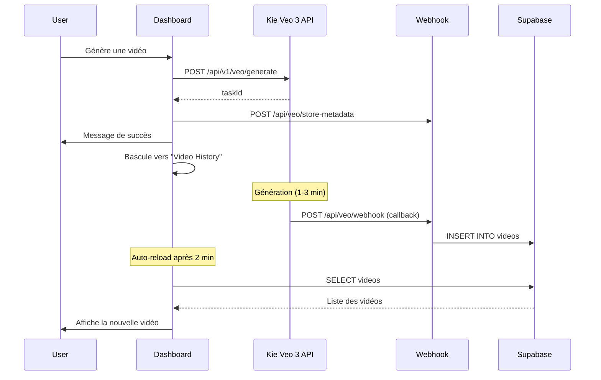

# Intégration Simplifiée Kie Veo 3 API

## Vue d'ensemble

Ce document décrit l'architecture simplifiée pour l'intégration de l'API Kie Veo 3 dans AdMaker AI.

## Architecture

### Flux de génération vidéo



## Changements Principaux

### 1. Suppression de la table `video_tasks`

**Avant** : Système complexe avec polling
- Table `video_tasks` pour suivre les tâches
- Polling régulier pour vérifier le statut
- Téléchargement + upload vers Cloudflare R2

**Après** : Architecture simplifiée
- Pas de table `video_tasks`
- Pas de polling
- Stockage direct des URLs Kie dans `videos`

### 2. Webhook Simplifié

Le webhook (`/api/veo/webhook/route.ts`) :
1. Reçoit le callback de Kie (URL ou JSON)
2. Extrait l'URL de la vidéo
3. Récupère les métadonnées du taskId
4. Insère directement dans la table `videos`
5. Nettoie les métadonnées en mémoire

### 3. API Client Veo

Modifications dans `lib/api/veo.ts` :
- Suppression de `extendVideo()` (non documenté par Kie)
- Suppression de `getVideoStatus()` (plus de polling)
- `generateVideoWithDuration()` retourne uniquement `{ taskId }`
- Support uniquement des vidéos de 8s

### 4. Dashboard

Modifications dans `app/dashboard/page.tsx` :
- Suppression de la logique de polling
- Bascule automatique vers "Video History" après génération
- Auto-reload de l'historique après 2 minutes
- Message de succès en français

## Modes de Génération Kie

### REFERENCE_2_VIDEO
- **Images** : 1-3 images
- **Aspect ratio** : 16:9 uniquement
- **Modèle** : veo3_fast uniquement
- **Usage** : Génération avec référence d'acteur + produit optionnel

### FIRST_AND_LAST_FRAMES_2_VIDEO
- **Images** : 1-2 images
- **Aspect ratio** : 16:9 ou 9:16
- **Modèle** : veo3 ou veo3_fast
- **Usage** : Génération avec première/dernière frame

## Expiration des URLs

⚠️ **Important** : Les URLs Kie expirent après **60 jours**.

Le champ `expires_at` dans la table `videos` est calculé comme :
```typescript
const expiresAt = new Date();
expiresAt.setDate(expiresAt.getDate() + 60);
```

L'interface affiche :
- Badge "Expiring Soon" si < 7 jours
- Badge "Expired" si expiré
- Avertissement de téléchargement

## Variables d'Environnement

```env
# API Kie Veo 3
NEXT_PUBLIC_VEO_API_KEY=your_kie_api_key

# URL de l'application (pour les callbacks)
NEXT_PUBLIC_APP_URL=https://your-app.vercel.app

# Supabase
NEXT_PUBLIC_SUPABASE_URL=your_supabase_url
NEXT_PUBLIC_SUPABASE_ANON_KEY=your_supabase_anon_key
SUPABASE_SERVICE_ROLE_KEY=your_service_role_key
```

## Schéma de Base de Données

### Table `videos`

```sql
CREATE TABLE videos (
  id UUID PRIMARY KEY DEFAULT gen_random_uuid(),
  user_id UUID REFERENCES auth.users(id) ON DELETE CASCADE NOT NULL,
  task_id TEXT UNIQUE NOT NULL,
  video_url TEXT NOT NULL,  -- URL Kie directe
  actor_name TEXT NOT NULL,
  actor_image_url TEXT NOT NULL,
  script TEXT NOT NULL,
  scene_description TEXT,
  duration INTEGER NOT NULL,
  format TEXT NOT NULL,
  status TEXT DEFAULT 'completed',
  expires_at TIMESTAMP WITH TIME ZONE,  -- Expiration Kie (60 jours)
  created_at TIMESTAMP WITH TIME ZONE DEFAULT NOW()
);
```

## Endpoints API

### POST /api/v1/veo/generate (Kie)

**Request** :
```json
{
  "prompt": "Scene description. Script text",
  "imageUrls": ["actor_url", "product_url"],
  "model": "veo3_fast",
  "aspectRatio": "16:9",
  "generationType": "REFERENCE_2_VIDEO",
  "enableTranslation": true,
  "watermark": "AdMaker AI",
  "callBackUrl": "https://your-app.vercel.app/api/veo/webhook"
}
```

**Response** :
```json
{
  "code": 200,
  "msg": "success",
  "data": {
    "taskId": "veo_task_abcdef123456"
  }
}
```

### POST /api/veo/webhook (Notre callback)

**Kie envoie** :
- **Format 1** : Plain text URL
- **Format 2** : JSON avec `resultUrls`

**Notre traitement** :
1. Extraire taskId et videoUrl
2. Récupérer métadonnées
3. Insérer dans `videos`
4. Retourner 200 OK

### POST /api/veo/store-metadata

**Request** :
```json
{
  "taskId": "veo_task_abcdef123456",
  "userId": "user_uuid",
  "actorName": "Business Woman",
  "actorImageUrl": "https://...",
  "script": "Hi! I'm excited...",
  "sceneDescription": "Professional office...",
  "duration": 8,
  "format": "16:9"
}
```

**Response** :
```json
{
  "success": true
}
```

## Tarification Kie

Selon la documentation Kie :
- **veo3_fast** : $0.30 par vidéo de 8s (60 crédits)
- **veo3** : $2.00 par vidéo de 8s (400 crédits)

AdMaker AI utilise **veo3_fast** pour un coût optimal.

## Limitations

1. **Durée** : Uniquement 8s (pas d'endpoint `/extend` documenté)
2. **REFERENCE_2_VIDEO** : Uniquement 16:9 + veo3_fast
3. **Expiration** : URLs expirent après 60 jours
4. **Images** : Maximum 3 images en mode REFERENCE

## Tests

### Test End-to-End

1. Sélectionner un acteur
2. Écrire un script
3. Cliquer sur "Generate Video"
4. Vérifier le message de succès
5. Vérifier la bascule vers "Video History"
6. Attendre 1-3 minutes
7. Vérifier l'apparition de la vidéo
8. Cliquer sur le lien vidéo
9. Vérifier la lecture

### Vérifier les Logs

**Vercel Logs** :
```
📹 Veo Callback POST received
🔍 Extracted taskId: xxx
💾 Saving Veo URL directly to Supabase...
✅ Veo URL saved to Supabase (expires in 60 days)
```

**Browser Console** :
```
✅ Video generation started, taskId: xxx
💡 Video will appear in history in 1-3 minutes
```

## Migration depuis l'ancienne architecture

Si vous migrez depuis l'ancienne architecture avec Cloudflare R2 :

1. Exécuter la migration SQL :
   ```bash
   # Dans Supabase SQL Editor
   DROP TABLE IF EXISTS video_tasks CASCADE;
   ```

2. Les anciennes vidéos dans R2 restent accessibles
3. Les nouvelles vidéos utilisent les URLs Kie
4. Pas de perte de données

## Support

Pour toute question sur l'API Kie :
- Documentation : https://docs.kie.ai
- Support : support@kie.ai
- Billing : https://kie.ai/billing
