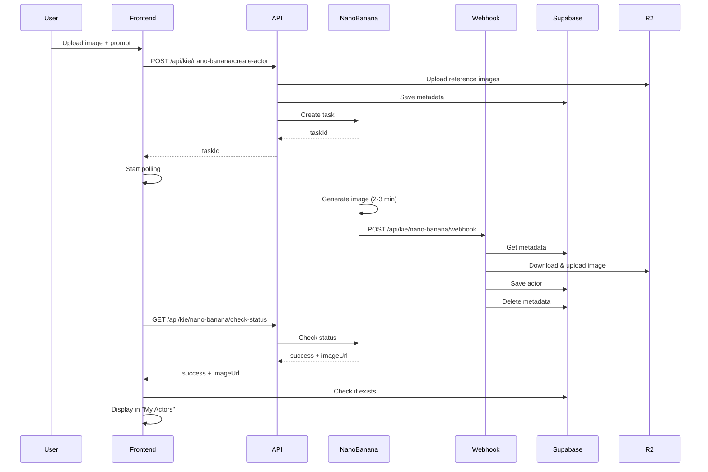

# Nano Banana Actor Creation - Setup & Debugging Guide

## Configuration

### Environment Variables

Assurez-vous que ces variables sont configurées dans Vercel et localement (`.env.local`) :

```env
# Nano Banana Pro API
KIE_API_KEY=your_kie_api_key_here

# Supabase (requis pour le webhook)
NEXT_PUBLIC_SUPABASE_URL=your_supabase_url
NEXT_PUBLIC_SUPABASE_ANON_KEY=your_supabase_anon_key
SUPABASE_SERVICE_ROLE_KEY=your_service_role_key

# Cloudflare R2 (pour stocker les images)
CLOUDFLARE_ACCOUNT_ID=your_account_id
CLOUDFLARE_ACCESS_KEY_ID=your_access_key
CLOUDFLARE_SECRET_ACCESS_KEY=your_secret_key
CLOUDFLARE_BUCKET_NAME=admakerai-media
CLOUDFLARE_PUBLIC_URL=https://pub-02bf1ac6244444b5810b067310ef4874.r2.dev

# App URL (pour les callbacks)
NEXT_PUBLIC_APP_URL=https://your-app.vercel.app
```

### Tables Supabase

Les tables suivantes doivent être créées (migration déjà présente) :

1. **`custom_actors`** - Stocke les acteurs créés
2. **`actor_generation_metadata`** - Métadonnées temporaires pour le webhook

## Flux de Création d'Acteur



## Debugging

### Vérifier les Logs Vercel

1. Aller sur [Vercel Dashboard](https://vercel.com)
2. Sélectionner le projet `admakerai`
3. Aller dans **Logs** ou **Functions**
4. Chercher les logs avec ces emojis :
   - 🍌 = Webhook Nano Banana
   - 💾 = Sauvegarde en base de données
   - ❌ = Erreurs
   - ✅ = Succès

### Vérifier Supabase

#### Table `actor_generation_metadata`

```sql
SELECT * FROM actor_generation_metadata 
ORDER BY created_at DESC 
LIMIT 10;
```

**Problèmes possibles** :
- Si des entrées restent longtemps : Le webhook n'est pas appelé ou échoue
- Si aucune entrée : L'API create-actor ne sauvegarde pas les métadonnées

#### Table `custom_actors`

```sql
SELECT * FROM custom_actors 
ORDER BY created_at DESC 
LIMIT 10;
```

**Problèmes possibles** :
- Si aucun acteur : Le webhook ou le polling ne sauvegarde pas
- Si doublons (même task_id) : Race condition entre webhook et polling (normalement géré)

### Vérifier le Webhook

#### Test manuel du webhook

```bash
curl -X POST https://your-app.vercel.app/api/kie/nano-banana/webhook \
  -H "Content-Type: text/plain" \
  -d "https://kie-result.s3.amazonaws.com/some-task-id/result.png"
```

#### Vérifier que le webhook est accessible

```bash
curl https://your-app.vercel.app/api/kie/nano-banana/webhook
```

Devrait retourner une erreur 405 (Method Not Allowed) car seul POST est accepté.

## Problèmes Courants

### 1. "No metadata found for taskId"

**Cause** : Les métadonnées n'ont pas été créées ou ont été supprimées.

**Solution** :
1. Vérifier que `SUPABASE_SERVICE_ROLE_KEY` est configuré
2. Vérifier les RLS policies sur `actor_generation_metadata`
3. Vérifier les logs de l'API create-actor

### 2. "Actor not appearing in My Actors"

**Cause** : L'acteur n'a pas été sauvegardé ou les RLS policies bloquent l'accès.

**Solution** :
1. Vérifier la table `custom_actors` dans Supabase
2. Vérifier que `user_id` correspond à l'utilisateur connecté
3. Vérifier les RLS policies sur `custom_actors`

### 3. "KIE_API_KEY not configured"

**Cause** : La variable d'environnement n'est pas configurée.

**Solution** :
1. Ajouter `KIE_API_KEY` dans Vercel → Settings → Environment Variables
2. Redéployer l'application

### 4. "Webhook not called"

**Cause** : L'URL du callback est incorrecte ou inaccessible.

**Solution** :
1. Vérifier que `NEXT_PUBLIC_APP_URL` est correct
2. Vérifier que le webhook est accessible depuis l'extérieur
3. Vérifier les logs Nano Banana pour voir si le callback a été tenté

### 5. "Image upload to R2 failed"

**Cause** : Credentials Cloudflare incorrects ou bucket inaccessible.

**Solution** :
1. Vérifier les credentials Cloudflare dans Vercel
2. Vérifier que le bucket existe et est accessible
3. Vérifier les permissions du bucket

## Test End-to-End

1. **Local** :
   ```bash
   cd admaker
   npm run dev
   ```
   - Aller sur http://localhost:3000/dashboard
   - Créer un acteur
   - Vérifier les logs dans la console

2. **Production** :
   - Déployer sur Vercel
   - Créer un acteur
   - Vérifier les logs Vercel
   - Vérifier Supabase

## Logs Détaillés

Les logs suivent ce format :

```
🍌 ============================================
🍌 Nano Banana Webhook POST received
🍌 Timestamp: 2025-12-17T10:00:00.000Z
📋 Content-Type: text/plain
📦 Raw body length: 123
📦 Raw body preview: https://...
🖼️ ✅ Received URL callback
📸 Image URL: https://...
🔍 Extracted taskId: abc-123
💾 ============================================
💾 Starting saveActorToDatabase
💾 TaskId: abc-123
💾 Image URL: https://...
🔍 Checking if actor already exists...
🔍 Looking for metadata with taskId: abc-123
✅ Found metadata for user: user-id
📝 Actor name: My Actor
📝 Prompt: A professional person
📥 Downloading image from Kie...
✅ Downloaded 123456 bytes
☁️ Uploading image to Cloudflare R2...
✅ Image uploaded to R2: https://...
💾 Inserting actor into custom_actors table...
✅ Actor saved to Supabase successfully
📊 Actor ID: actor-id
🧹 Cleaning up metadata...
✅ Metadata cleaned up successfully
💾 ============================================
🍌 ============================================
```

## Support

Si le problème persiste après avoir suivi ce guide :

1. Vérifier les logs Vercel avec les emojis ci-dessus
2. Vérifier les tables Supabase
3. Tester le webhook manuellement
4. Vérifier que toutes les variables d'environnement sont configurées
